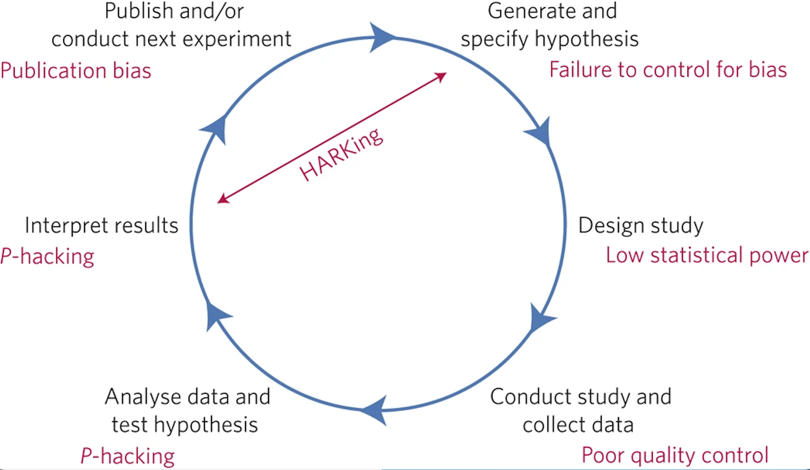
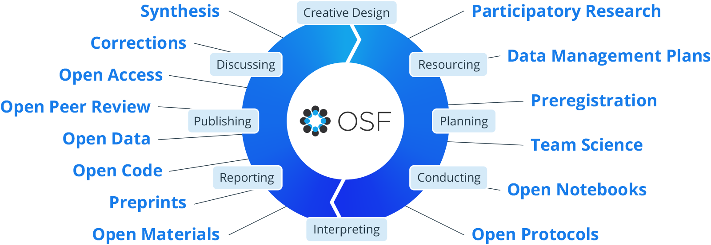

# [Scientific Research in Social Psychology ]{style="color: #004b23"} {.unnumbered}

[written by Monica Gonzalez-Marquez, Savannah C. Lewis, and Mahmoud Elsherif]{style="color: gray;"}

## What is science? 

When we think of “science”, we often imagine a textbook full of facts or a chemist in a lab coat. This assumption stems from the way that science is typically taught. Educators tend to focus on its “uniqueness”, its supposed access to objective truth, and how its many discoveries have changed the world.  But from the perspective of a researcher in training, science is something much more grounded. Instead of merely a collection of facts, science is a process of inquiry informed by the human problem-solving capacity. We developed this process, known as the Scientific Method, to understand natural phenomena. We later developed the IMRAD paper-writing structure (Introduction, Methods, Results, and Discussion) to document how this understanding was achieved so that others could build upon it. Hence, the three key concepts a researcher-in-training needs to understand are,

1. Science was developed to understand natural phenomena.
2. Science is informed by the human problem solving capacity.
3. Scientific knowledge builds on our understanding of how prior knowledge was created.

To better understand these concepts, and how they are not only connected but interdependent,  let’s begin by examining how science is a sequence of nested problems to be solved via two examples.

Imagine you are a second-year psychology student investigating how social pressure affects career choices. This is your "Meta-Problem." To solve it, you encounter a series of decision points, including:

- *The "Why" Problem:* Are you trying to understand the process of choosing, or change the outcome?
- *The "Who" Problem:* Do you study 18-year-olds entering college or 40-year-olds changing careers?
- *The "Definitions" Problem:* Is "social pressure" parental disapproval, peer influence, or social media trends affecting career choices?
- *The "How" Problem:* Will you use qualitative interviews or an experimental survey?
- *The “Incentive” Problem:* How will you reimburse your participants? Will they volunteer, will they be paid or receive course credits?

Now consider a parallel example of this decision process in a non-scientific setting.  Imagine you want to build a wooden desk but have never built one before. Again, you would face a series of decision points, including: 

- *The "Purpose" Problem:* Is it for dining, a patio, or a workspace? You choose a desk.
- *The "Material" Problem:* Wood, stone, or plastic? You choose wood.
- *The "Dimension" Problem:* How tall are the legs? How thick are the legs?
- *The "Stability" Problem:* Metal legs or wooden ones? How do you attach them so it does not wobble?
- *The "Specificity" Problem:* Are the planks pre-cut or are they made of timber?

At first glance, a social psychology study and a wooden desk have nothing much in common. But once you look more closely, you see that both are descriptions of a process related to *iterative problem-solving*. This hierarchy reveals a fundamental truth: science is a chain of dependencies. In both cases, the ‘lower’ problems are foundational - they provide the constraints for everything that follows. You cannot choose the teeth of your saw for the desk until you have selected the density of your wood. Similarly, you cannot choose a statistical test (the study) until you have defined the boundaries of your population. When we solve the lower problems first, the higher solutions become logical necessities as opposed to random guesses. 

If you build that table and it is the most stable, beautiful desk in the world, your "finding" is great. But if you did not write down the type of wood, the specific measurements, or the tools used, no one else can build a better version of it. They might get "close," but they would not  be building on your work—they will be guessing.

Now, compare the steps above to the problem-solving cycle in Figure 1.

![Figure 1. From the ideal to reality. This comparison shows that the scientific process is not a separate ritual, but a more complex nested application of the universal human problem-solving cycle. The messiness of the third diagram exemplifies why transparent documentation is essential to helping others navigate the decision processes that underlie the results of a study, as well as making it possible to build upon the science.  Science does not build on findings alone. A scientific result without a clear description of the scientific process used to generate it is like a plate of fried tofu without a recipe: You can taste it, but you cannot recreate it or improve upon it or see how changing an ingredient or measurements changes its final product. Science builds on the processes that gave us those results.](scienceprocess.png){ width=\\textwidth}
The examples and figure above highlights the difference between two terms that are often confused, Scientific Method and Scientific Process. 

The *scientific method* is simply the formal name we give to the general human problem-solving mechanism applied to the process of knowledge generation and documentation.  In contrast, a *scientific process* is an instantiation of the scientific method. The development of the polio vaccine and development of our knowledge of gravity are very different scientific processes. The polio vaccine involved addressing problems and making decisions about cows and viruses, and gravity about the mass of objects and their velocity upon falling,  yet both followed the same generalized problem solving mechanisms formalized as the scientific method. They each involved several layers of nested problem solving and decision-making by human minds, thus exemplifying how science is a deeply human way of understanding the world [@bechtel_discovering_1993].

> [#definition]{#def-scientificmethod style="color: orchid"}  Scientific Method 
>
> The universal, step-by-step logical framework that underlies all scientific inquiry. The scientific method is a defined, step-by-step process for investigating phenomena. 
It is a formalization of a generalized human problem solving process (see below).

> [#definition]{#def-scientificprocess style="color: orchid"}  Scientific Process
>
> The specific methods and approaches (e.g., saw for the table or surveys) that scientists use based on their specific field and matter. various methods and approaches scientists use to investigate phenomena in their pursuit of knowledge.

You will note that the steps to determine how you build the table comprise a rather mundane example of problem-solving. The schema describes the steps we typically undertake when we are solving any problem in everyday life, ranging from how to roast a chicken to how to solve a math problem. Regardless of the intended outcome, we engage in the same generalized sequence of actions. Now look at the schema for the scientific method next to it. What similarities and differences do you see? The language may be a bit more formal, but the processes are very similar, so much so that they are essentially variations of each other. You observe something, notice there is something you do not know, figure out a way to understand that unknown, execute your plan and evaluate the results. Regardless of the intended outcome, we engage in the same generalized sequence of actions. This makes science and teaching it a deeply human process [@bechtel_discovering_1993].

The final schema in Figure 1 shows a scientific process. The distinction between the scientific method and a scientific process is key to understanding how subjectivity is not strictly an inherent characteristic of qualitative science, but is actually constitutive of all science, and is an expression of the problem-solving process from which it is derived [@bechtel_discovering_1993; @gopnik_scientist_1999].  In our table example, we presented several levels of problem solving embedded as part of the main steps. These sub-steps are represented in the iterated scientific method schemas found overlapping the steps of the main scientific method. If you considered that you might have approached addressing those sub-steps differently than how we described them, you probably also realized that there is no "one" correct way to conduct these sub-steps. Different people will do things differently according to their training and experience. An architect would likely approach the process differently than a do-it-yourselfer (DIY). It is no different in science. The vagaries of training and experience will create differences between how different problem-solvers deal with a problem, even as the generalized problem-solving process itself will be virtually the same.  These differences mark the distinction between the scientific method and a scientific process. The scientific method is the idealized, schematized form, and the scientific process is how a specific research question was actually addressed. This messiness is reflected in the third schema in Figure 1, thus underlining that no two scientific processes will or can be exactly the same. 

A scientific process, no matter how productive, means little if it is not well documented. This documentation is what scientific knowledge builds upon. A finding alone, without an understanding of how it came about, is anecdote. We cannot develop reliable and usable scientific knowledge on anecdote. We need structured information of how problems were formulated, the decisions that were made, and what was actually done. The IMRAD structure mentioned above was developed to provide the needed information. That said, as a guide to documentation, it lacks the structure needed to take into account the nested nature of problem-solving in science. Methods is not a monolith but involves a set of nested, interconnected and interdependent problems/tasks that must be carried out to obtain the needed data. For example, we must choose an experimental method, obtain the physical apparatus, design a protocol, determine types of participants, develop a plan to recruit them, etc. Each of these is nested beneath the Methods umbrella, and each requires reliable documentation of its development process, and justification of accompanying decisions/choices.  

In science, anything that interferes with the accurate documentation of these problem-solving steps is a danger to the reliability of the scientific record. This includes:

- *Closed Access:* Hiding the "instructions to build a table" behind a paywall.
- *Lack of Training:* Not teaching students how to document and justify their problem-solving processes, including decisions made as part of those processes.
- *Questionable Research Practices (QRPs):* Practices that researchers sometimes engage in that unintentionally or intentionally increase the chance of false or misleading results [see @nagy_bestiary_2025]. 

> [#definition]{#def-qrps style="color: orchid"}  Questionable Research Practices (QRPs)
> 
> Questionable research practices are  actions that fall into a "grey area" between honest errors and outright fraud. They are often described as "p-hacking" or "data dredging" methods used to make a study's results look more significant or consistent than they actually are.

All of this matters deeply because our ultimate goal as researchers is to create reliable and usable knowledge for our peers and for posterity. This is our societal role and our responsibility. It means that our aim should be to document our work so well that someone else can understand and use that knowledge, and potentially reproduce it, 20 years after our death. 

When we acknowledge that science is a human product of problem-solving, we realize that *good documentation is the foundation of science as a collective activity*. It is the only way to ensure that the scientific record is a usable human endowment rather than a collection of "anecdotes" that can neither be well-understood nor reproduced.

> [#yourturn]{style="color: green"}  
> What is the idea behind psychological research?

## What can go wrong in the scientific process? 

> “‘Objective knowledge’ is an oxymoron.”
>
> — Patricia Gowaty, Feminism and Evolutionary Biology [as cited in @cooke_bitch_2022].

Historically, the Victorian academic establishment understood that science was not always a neutral or purely rational endeavor; rather, it was, and remains, shaped by the social, cultural, and political context in which it is embedded. Scientific bias is notoriously difficult to address because it is often unseen by the very researcher it affects. We are all conditioned to see the world through our own lenses, shaped by experiences, identities, and societal influences [@elsherif_lived_2025; @pownall_feminist_2021]. Acknowledging the limitations of objectivity requires courage, reflection, and humility.

Science is often idealized as the pursuit of objective, unbiased knowledge, understood to be derived purely from empirical methods and rigorous testing.  However, science being perceived as an objective truth has led to more issues arising where studies are found not to replicate [@pennington_students_2023]. Science is also a human pursuit. Like any profession, it has a culture, where a set of social pressures, incentives and unwritten rules influences what gets studied and what gets ignored. For a long time, this research culture prioritized convenience and “flashy” results. If a scientist wanted to get a permanent position or a promotion, they needed to publish “exciting” new discoveries in famous journals. This created a “Publish or Perish” culture where boring but accurate work was often suppressed or ignored  in favour of results that made headlines. For instance, across nine experiments, Daryl Bem [-@bem_feeling_2011] investigated the phenomenon of precognition, exploring whether future events can retroactively influence present behaviour. Through diverse methodologies, including predicting the location of erotic images, avoiding unforeseen negative stimuli, and “retroactive priming” where future words affect current reaction times. Bem, consistently, observed that participants performed above chance. The authors suggested that future exposure to images or practicing word lists could influence a participant’s preferences and memory recall (see chapter on feeling the future). Bem concluded that individuals may implicitly anticipate upcoming events in ways to shape their current actions and processes. This paper was published in a peer-reviewed journal well respected in social psychology - the *Journal of Personality and Social Psychology*.

The publication caused an uproar within the scientific community and rightfully so! Precognition is outside of current scientific explanations and laws of physics, thus conflicting our understanding of how the universe, reality and world works! If we assume science is an objective process, then these findings should be accepted as true. But this created a crisis in logic: it suggested that humans could see the future but the problem might not be the future, but the rules of the game themselves. The findings were questioned, re-analyzed [@WagenmakersWetzelsBorsboomVanDerMaas2011] and replicated [@GalakLeBoeufNelsonSimmons2012; @RitchieWisemanFrench2012].  You can read more details about this study and its echo in psychological research in a chapter of this book [(see Feeling the Future)](chapter6.qmd).

This back-and-forth sparked a crisis within the field. Where were there null findings? Why did the math seem to work for something that defied reality? Most importantly, what did it mean for our field? In this system, science risked serving the careers of individuals as opposed to the needs of the public. But ultimately, science should be in the service of people. This means recognizing humanity in scientific work, acknowledging bias, embracing replication and transparency, and striving for a research culture that prioritizes credibility over convenience. Here, collaboration and discussion were happening to challenge our biases. By recognizing that science is fundamentally a human pursuit and prioritizing integrity, we transform science from a rigid, infallible machine into a collaborative, self-correcting community.

Psychology, in particular, has undergone a period of self-reflection and reevaluation. The replication crisis, now referred to as the credibility revolution, where many prominent findings failed to replicate, has sparked changes in how research is conducted. For example, the once-famous theory of “Power Posing (the idea that body posture changes your confidence and hormones) was a staple of introductory textbooks until massive replication efforts showed the effect was likely a statistical fluke. A defining moment in the emergence of the "replication crisis" or credibility revolution was the 2015 Reproducibility Project conducted by the @open_science_collaboration_estimating_2015. This massive undertaking involved 270 researchers attempting to replicate 100 psychological studies. To maximize rigor, the team used larger sample sizes for increased statistical power, collaborated with the original authors and newcomers, and used pre-registration to mitigate researcher bias. Despite these safeguards, only 36% of the studies yielded significant results (p < .05), with social psychology showing a particularly low success rate of 25%. These figures stand in stark contrast to the expected 89% replication rate if the original effects were robust [@field_when_2019]. Furthermore, the observed effect sizes in the replications were roughly half the magnitude of the original findings, sparking widespread concern across the scientific community. As @smaldino_natural_2016 noted that the industry had accidentally created a system that rewarded “flashy” results over reproducible ones.  This served as a vital "wake-up call" for the industry, showing that even the most popular theories need to be tested multiple times.  Researchers began to question why this was the case. 

However, many scholars and scientists [e.g., @bishop_psychology_2020; @sulik_differences_2025] have pointed out that the foundations of science itself are not immune to personal and societal biases. One particular bias was confirmation bias. As humans, we look for arguments that support our hypotheses and theories [i.e., confirmation bias, @bishop_psychology_2020]. This is not a flaw but it is a part of being human. Science can only work if we accept the fact that science is not a neutral and apolitical process. Humans have biases and we need to be aware of them and consider ways to address them. One approach to challenge confirmation bias was pre-registration, where you plan to date and time-stamp your analysis plan and hypotheses before the study is conducted [@nosek_making_2017]. Here you include your confirmatory or hypothesis driven research  and can also include exploratory or data-driven research in order to ensure findings are replicable and robust in order to challenge these biases. Although this was perceived as a panacea at first to cure the researcher biases, there were issues that arose to challenge these biases. First, the lack of analytical discussion, theoretical discussion or constructs within pre-registration [e.g., @sarafoglou_survey_2022; @szollosi_arrested_2021]. Second, registrations were too vague or too specific that they did not leave room for discussion [e.g., @bakker_ensuring_2020; @binney_practical_2025] and finally, the documentation and pre-registration did not match [@van_den_akker_preregistration_2023; @van_den_akker_potential_2024-1]. This highlights even when we have remedies, we are still biased to try and find evidence in favour of our theories and hypotheses. 

In addition, this is not limited to just conceptualisation but also data analysis. @silberzahn_many_2018 asked 29 independent teams to analyze the same hypothesis whether referees would give dark skin-toned players more red cards than light-skin-toned players. The authors observed that 20 teams out of 29 found evidence supporting the hypothesis, while 9 teams did not observe this pattern [see also linguistics: @coretta_multidimensional_2023; ecology and evolutionary biology: @gould_same_2025]. As a result, scientists should use a reflexive approach. This means they do not study others but they constantly should check their own analyses, assumptions and theories [@jamieson_reflexivity_2023]. During this time, scientists should ask how we get to the result. How do they arise, what was the design, what was the design based on? Was it their training, research culture and social interaction [@sulik_differences_2025]? By questioning these established norms, researchers can ensure they are not accidentally trying to confirm their own assumptions, similar to confirmation bias, but also to challenge their stereotypes. Put simply, there will always be a reason for why this question is interesting, whether it is how you tested participants, how you collected the data and the analyses done. What seems objective, detached and apolitical, is actually more subjective than it should be. Data analysis is more of an art than a science, as these decisions are made actively and purposely by our values and by human beings not robots. Put simply, Patricia Gowaty's assertion that “objective knowledge” is an oxymoron challenges the notion that science can ever be fully detached from the people who practice it. While it may seem counterintuitive to suggest that subjectivity improves science, the advantage lies in transparency and honesty [@frank_blind_2024]. By acknowledging that humans, not robots, analyze data, we move away from 'hidden biases' and toward a system of radical transparency, where every decision is documented and debated. Science is not the same as a collection of static facts. Instead, science is a method, a process of refining our understanding of the world through systematic inquiry. As such, science is not a sprint to definitive answers but a marathon of continuous questioning and testing [e.g., @owens_long-term_2013].

> [#yourturn]{style="color: green"}  
> Let's think back to the scientific process! What are some of the things a researcher might do in this process to introduce bias?

Looking back at Figure 1, scientific studies almost never give a straightforward “yes” or “no” answer. Instead, research helps us estimate how likely a conclusion is to be true based on the evidence collected. In other words, science does not claim absolute certainty; it tells us the probability that a finding reflects something real rather than random chance. This is why results are reported using statistics because they help us judge the strength and reliability of the evidence. However, researchers sometimes engage in practices that unintentionally increase the chance of false or misleading results. These are known as questionable research practices (QRPs), and they can occur at multiple stages of the research process. Some of the common QRPs in psychology include:

- *P-hacking*, which involves analyzing data in multiple ways and selectively reporting only those that yield statistically significant - results. This can involve trying different combinations of variables, excluding certain participants, or stopping data collection - once a desired result appears [@hardwicke_only_2014]. We do this to clean data until it matches our expectations.
- *HARKing (Hypothesizing After Results are Known)*, in which researchers present their findings as though they confirmed a - pre-existing hypothesis, when in fact the hypothesis was developed after looking at the data. This gives a false impression of - theoretical support [@nosek_registered_2014].
- *Publication bias*, the tendency for journals to publish only studies with statistically significant or novel findings, leaving null - or contradictory results unpublished and distorting the scientific literature [@franco_publication_2014].
- *Using small samples*, which reduces statistical power and increases the likelihood that findings are due to chance or are not - replicable [@button_power_2013].
- *Relying on WEIRD samples* (Western, Educated, Industrialized, Rich, and Democratic populations), which limits the generalizability - of findings to broader or more diverse populations [@henrich_weirdest_2010].
- *Formulating vague theories*, which are difficult to falsify or test rigorously, reducing the scientific value of research [@dienes_understanding_2008].

> [#definition]{#def-phacking style="color: orchid"} P-Hacking
> 
> P-Hacking is the practice of manipulating data analysis until non-significant results (p > .05) become statistically significant (p < .05).

> [#definition]{#def-harking style="color: orchid"}  HARKing
> 
>  HARKing is Hypothesizing After the Results are Known and where a lucky guess looks like a solid scientific theory. It violates the principle that a theory should be able to *predict* behavior, not just describe it after the fact.

> [#definition]{#def-statisticalpower style="color: orchid"}  Statistical Power
> 
> Statistical power is the probability that a study will detect an effect (a real relationship) if that effect actually exists.

> [#definition]{#def-publicationbias style="color: orchid"}  Publication Bias
> 
> Publication Bias is the tendency for journals to publish only "positive" results (studies where something happened) while ignoring "null" results (studies where nothing happened).

> [#definition]{#def-WEIRD style="color: orchid"}  WEIRD
> 
> An acronym for people from Western, Educated, Industrialized, Rich, and Democratic (WEIRD) backgrounds. When relying on samples of WEIRD participants, scientists are looking at a unique subgroup that does not represent the general population. This makes it difficult to claim that these findings are universal truths about human nature.

> [#definition]{#def-replication style="color: orchid"}   Replication
> 
> Replication involves repeating a study using the same methods and sample size to see whether the results hold up. Replications help identify which findings are reliable and support the self-correcting nature of science.

Now let’s consider where each of these QRPs may be introduced in the scientific cycle.

{ width=\\textwidth}

The journey begins with coming up with a hypothesis, which is a testable explanation or an educated guess about something that works. Researchers may use or create a vague theory that is susceptible to confirmation and reinterpret after the data is collected to formulate this hypothesis [see Figure 2, @munafo2017manifesto]. In the next stage, researchers will be in the study design phase, where they will create the design of the study, here depending on their research question, researchers will need to consider the type of participants being recruited. If researchers are testing a specific population, then they can consider that specific population. However, even when they are making comments about the human population, researchers tend to rely only on WEIRD samples. These groups do not represent the whole world, and consequently, the findings might not apply to the other 95% of the global population [@arnett_neglected_2008]. If a study uses a group that is too small, it has low statistical power. Think of this like trying to take a photo in a pitch-black room; the "image" (the result) will be so grainy and blurry that you might miss the truth or mistake a random shadow for a real object (a false positive). A sample that is too small will yield similar noisy results, making it difficult to say what is a true or a false positive. After gathering data, researchers use math to see if their results are meaningful. However, researchers sometimes fiddle with their math or try different shortcuts until they find a result that looks statistically significant, even if it is a lucky coincidence. After seeing the results, it is time to explain what they mean. Researchers may engage in HARKing (Hypothesizing After the Results are Known). HARKing means looking at the results and then pretending the observed outcome was expected from the start, before the results were known. This is like shooting an arrow at a blank wall and then drawing a bullseye around where it landed, pretending that was the target you were aiming for all along. Finally, the research is shared with the world. However, scientific journals often prefer "exciting" new discoveries over "boring" results where no significant effect was found. This creates publication bias, a systemic filter that skews our library of knowledge by hiding the "misses" and only showing the "hits" – or the effects we think might be “hits”. This bias creates a lack of transparency in the scientific record, when journals only show the successes, the underlying questionable research practices such as selective reporting become invisible. Each of these practices, while sometimes unintentional, undermines scientific transparency. By recognizing these stages, and their traps, we can build a more trustworthy bridge between our questions and the truth.

One of the most important tools to combat these problems is replication. Replication involves repeating a study using the same methods and samples to see whether the results hold up. When a study replicates under the same conditions, it increases our confidence that the original findings were not due to chance. However, a “perfect” 100% replication is an impossible ideal. Research is always situated and conducted at a specific point in time, within an unique cultural climate and with specific participants, the study can never be perfectly recreated or frozen. Recognizing this situatedness is important. It suggests that when a study fails, we should not automatically assume there is a flaw in the original work or it was fabricated but that the finding may be sensitive to environmental or temporal changes. 

When replications introduce small but deliberate variations, they can help evaluate how robust a finding is across different populations or contexts. In this way, replication serves as a safeguard against QRPs and helps strengthen the foundation of scientific knowledge. In recent years, social psychology has undergone a "Replication Crisis" after several high-profile findings failed to hold up when tested again by independent labs. This led to a movement to restore credibility through the Credibility Revolution. The most significant of these new standards is preregistration. This is the practice of a researcher publishing their hypotheses, experimental design, and data analysis plan in a public registry before they ever collect a single data point. By "locking in" their plan ahead of time, researchers cannot later engage in p-hacking or HARKing, because any changes to their plan would be visible to the public.  By combining replication with open data (sharing raw files) and full reporting, the field is moving away from a "trust me" model toward a "show me" model, effectively strengthening the foundation of scientific knowledge and rebuilding public trust. 

Transparency is not just a methodological concern, it is an ethical one. Without transparency, questionable research practices go unnoticed, undermining public trust and the credibility of science itself. When scientists are not open about their data, methods, or limitations, it becomes difficult for other researchers, or the public, to evaluate the validity of their findings. As @wingen_no_2020 argue, trust in science requires openness and integrity.

> [#yourturn]{style="color: green"}  
> What are reasons why researchers might engage in QRPs?

You might find it difficult to imagine why researchers engage in QRPs. After all, researchers are committed to finding out things about the world, and QRPs make it harder to generate robust and reliable insights. To understand why QRPs may nevertheless take place, you could consider that they sometimes occur unintentionally. Perhaps a researcher simply did not know better. That is one reason why the Credibility Revolution has emphasized the need for high-quality training in avoiding QRPs (and in practicing more responsible research practices instead). 

In addition, consider the context in which researchers work. We already touched on the issue of publication bias, making it more difficult to publish research that is not considered “exciting” or that does not show significant results. This also means that researchers may invest a lot of time and other resources into a research project that does not end up being published. In such cases, these resources are wasted, both because the public or other researchers can never access the research (because it remains unpublished) and because researchers need publications for progressing with their careers and for starting (new or follow-up) research projects. As you recall from above, this system of incentives is often referred to as “Publish or Perish”. Because researchers need publications, they may use QRPs strategically to turn what they may consider a failed project, or a project that just falls short of being a shooting star, into a success story [@yong_inevitable_2016]. By glossing over inconsistent findings (cherry picking, see above), for instance, they might increase their chances of getting their research published. In an academic system where hiring decisions, decisions about promotions, and decisions about research funding in large parts depend on how many publications a researcher has [@abele-brehm_wer_2016], you might see why it is tempting to use QRPs to get to publish: Researchers who do so play by the rules of the game in academia. As a consequence, to maintain the integrity of scientific research and guard against QRPs, more and more voices have called for changing academic incentive systems into conditions supporting collaboration, transparency, and responsible research practices [@rahal_quality_2023; @tiokhin_shifting_2024].

## How can we improve our scientific process in psychology? 

Scientific research should be accessible to everyone. This means that both researchers and the general public should be able to easily access, understand, and evaluate scientific findings [e.g., @nosek_replicability_2022]. Responsible research practices (RRPs) are designed to increase the credibility, transparency, and reproducibility of scientific findings. These practices address many of the problems introduced by questionable research practices and help create a more trustworthy and inclusive research culture. In social psychology, researchers are increasingly adopting a number of responsible practices that improve how studies are designed, conducted, and shared. 

> [#definition]{#def-responsibleresearchpractices style="color: orchid"}  Responsible Research Practices (RRPs)
>
> Practices that researchers or journals can do to increase the credibility, transparency, and reproducibility of scientific findings. 

Some of the common RRPs in psychology include:

- *Preregistration*, which involves documenting hypotheses, methods, and analysis plans in advance of data collection. This reduces - researcher flexibility and helps prevent QRPs like p-hacking and HARKing by creating a public record of the study’s original - intent.
- *Open data*, where researchers make their raw datasets publicly available so that others can verify results, conduct new analyses, or - replicate findings. This increases transparency and allows for greater scrutiny.
- *Open materials*, which refers to sharing all the tools used in a study—such as surveys, instructions, tasks, or stimuli—so other - researchers can accurately replicate the study or adapt it for different contexts.
- *Open code*, where the analysis scripts or software used to process and interpret data are shared publicly. This allows others to - reproduce statistical results exactly and learn from the analytical approach.
- *Open access*, which means that research articles are published in ways that make them freely available to everyone, not just those - affiliated with universities or institutions. This increases public engagement and makes research more equitable.
- *Registered reports*, a publishing format where study plans are peer-reviewed and accepted before data collection begins. This - reduces publication bias and helps ensure that studies are valued for their design and theoretical contribution, not just their - results.
- *Big team science*, a collaborative approach where large, multi-site teams of researchers conduct studies together. This leads to - larger, more diverse samples and helps ensure findings are more robust and generalizable.

Social psychologists can learn from other scientific disciplines, such as neuroscience and genetics, which have embraced large-scale collaborative projects and open repositories to pool data and improve generalizability. Likewise, other fields could adopt social psychology’s strengths in understanding how context, motivation, and identity shape human behavior, enriching how we interpret individual and group differences.

{ width=\\textwidth}

When we think about the scientific process, we can integrate open science practices into each stage of the scientific research cycle to promote transparency, reproducibility, and accessibility [Figure 3, @center_for_open_science_open_nodate]. At the beginning of the process, researchers can pre-register their hypotheses and study designs, which helps prevent questionable practices like p-hacking and hypothesizing after results are known (HARKing). During the study design and data collection phases, sharing open code and materials ensures that others can understand and replicate the methodology. Once data are collected, using open source software allows for reproducible analyses, and sharing open data allows others to verify results or conduct new analyses. When interpreting and reporting results, making them available through preprints and open access publications ensures that findings are accessible to the public and scientific community, regardless of institutional access. Finally, this cycle continues as researchers use these openly shared resources to publish and build on existing knowledge, improving the overall robustness and equity of scientific research.

Scientific methods and results should also be clearly reported so that other researchers can replicate studies and build on existing knowledge [@munafo2017manifesto]. Social psychology, in particular, has experienced a shift toward preregistration, registered reports, and increased emphasis on replication, which are practices other areas of science might also benefit from adopting. Making methodology transparent not only improves reproducibility but also allows for greater critical engagement with findings.

Science should also be inclusive and collaborative. Scientists from all backgrounds should have equal opportunities to contribute to the research process [@merton_matthew_1968; @merton_matthew_1988]. Inclusive science values diverse perspectives, leading to more creative and relevant research questions and reducing the likelihood of bias or blind spots. Social psychology has much to gain from cross-cultural research and incorporating intersectional frameworks that consider how overlapping identities shape psychological experiences, approaches that could also inform behavioral sciences [@blasi_over-reliance_2022; @puthillam_guidelines_2024; @wang_why_2016].

Finally, science is self-correcting. Errors and mistakes are a natural part of the scientific process, and when identified, they should be acknowledged and addressed. This ensures that the body of scientific knowledge remains based on accurate and up-to-date evidence [@ioannidis_correction_2022]. Social psychology's willingness to look in the mirror and admit lack of replication did not weaken the field but modernized it, allowing others to see it as a more scientific endeavour. By leading the Open Science movement, it provided a blueprint for how all scientific disciplines can move from a culture of ‘getting published’ to a culture of getting it ‘right’.  At the same time, social psychology can benefit from adopting more robust statistical practices, theoretical specification, and computational modeling used in disciplines like economics and epidemiology. Empirical science also benefits from recognizing both individual differences, such as genetic predispositions, and the malleable aspects of human nature shaped by culture, experience, and environment. Together, these perspectives foster a more complete understanding of human behavior.

> [#yourturn]{style="color: green"}  
> What are social psychologists doing to improve research practices in social psychology?

## Summary

Science, at its core, is a human endeavor, imperfect, evolving, and deeply rooted in our limitations as well as our capacity for insight. Scientists must embrace the reality that much of what we believe today may be refined, corrected, or forgotten in the future. This is not a weakness but a fundamental strength of the scientific process. Especially in social psychology, a field concerned with the foundations of human behavior, acknowledging our fallibility is key to meaningful progress.

Contrary to how it is often portrayed in textbooks [@gross_psychology_2015; @hewstone_introduction_2020; see review by @blachowicz_how_2009], science is not a rigid set of steps or an infallible machine. It is a dynamic, iterative process shaped by context, values, and uncertainty. Findings once treated as foundational can be overturned by new evidence and perspectives. This can feel chaotic, but it reflects how knowledge truly grows, through critique, debate, and discovery.

We must also cultivate cultural conditions that support responsible research practices: open data, preregistration, replication, and collaborative science. These practices help improve transparency and trust, making the process not just more rigorous, but also more humane.

To conclude: Is science messy? Absolutely. But so is reality. Accepting this complexity does not diminish science, it reveals its beauty. By remaining open to new evidence and showing kindness to one another in our disagreements, we make space for better questions, better answers, and a better understanding of the world.

